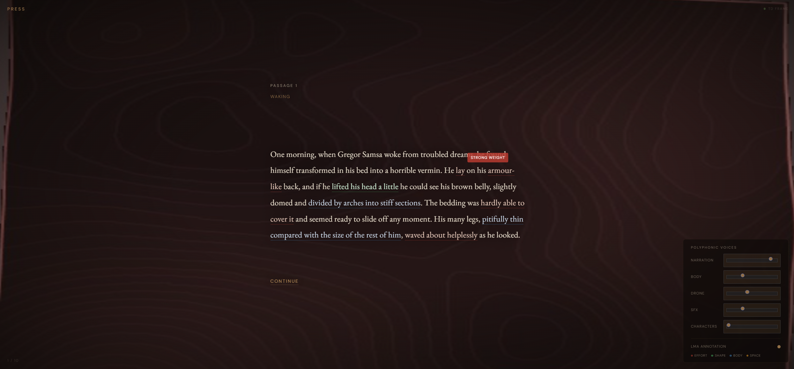

# Metamorphic Efforts

**Visualizing Laban Movement Qualities from Kafka's *The Metamorphosis***

*Embodied polyphony: enacting the kinesthetic body of prose.*

Steffen Møgelmose (smogel22@student.aau.dk) - Embodied Interaction Mini-Project, MED8, Aalborg University Copenhagen, Spring 2026

Website: [mogelmose.org](https://mogelmose.org) | [Full report](report/full_report.md)

---
## 1. Main Reference

**Fdili Alaoui, S., Francoise, J., Schiphorst, T., Studd, K., & Bevilacqua, F. (2017). "Seeing, Sensing and Recognizing Laban Movement Qualities." In *Proceedings of the 2017 CHI Conference on Human Factors in Computing Systems* (CHI '17). ACM, 4009--4020.**

Fdili Alaoui et al. investigate how Laban Movement Analysis (LMA) can be computationally modeled by incorporating movement expertise into multimodal sensing systems. Working with certified LMA practitioners, they create feature sets from positional, dynamic, and physiological sensor data that match how experts understand the four qualities of Laban effort: Flow, Time, Weight, and Space. Their assessment indicates that the integration of multiple data modalities significantly enhances the character of Effort in comparison to a single modality. This paper adopts a phenomenological perspective (Merleau-Ponty, Dourish): computer systems should regard movement as a lived, expressive experience, rather than merely as functional input.

### Key Insights from the Paper

Effort factors serve as the primary parameterization, generative output serves as the rendering target, and BESS annotation serves as the structured input in the **pipeline structure**. Where their study goes from physical body to sensors to Effort classification, this project locates the moving body in literary prose - Kafka's text captures the corporal struggle in precise kinesthetic language. The generative system creates the effort qualities after the close reading extracts them using the same BESS framework as physical bodies.

The five-layer audio design and the integrated visual field are motivated by the **multi-modal principle**, which posits that Effort is better characterized by multiple modalities than by any single channel. Character voices, drone timbre, sound effects, body vocalizations, narration (vocal delivery), and visual noise texture all express each effort factor at the same time. 

## 2. Supporting References

### Siopa et al. (2024). "Ghostdance." In *Proceedings of MOCO '24*.

In Ghostdance, a live VR dance performance, an LSTM classifier identifies the eight LMA Action Drives from a dancer's IMU data and routes them to Unity particle system presets and spatial audio in real time. The pipeline operates through live body to classification to audiovisuals.

The **Action Drive preset-selector architecture**. Each of the eight Action Drives is a separate preset that changes the state of all eight modes at the same time. As a direct example, when a Twine passage changes, its annotated Action Drive chooses both a visual preset (noise amplitude, speed, blur, zoom, color) and an audio configuration. The primary distinction is the input stage, where close reading replaces LSTM classification and TouchDesigner noise/feedback replaces Unity particle swarm.

| | Ghostdance | Metamorphic Efforts |
|---|---|---|
| Movement input | Live dancer (IMU sensors) | Literary prose (close reading) |
| Effort extraction | Real-time LSTM classification | Manual BESS annotation |
| Output medium | Unity particles + spatial audio in VR | TouchDesigner noise/feedback + ElevenLabs TTS in browser |
| Interaction model | Dancer performs, audience watches | Viewer reads, system responds |

### Larboulette & Gibet (2015). "A Review of Computable Expressive Descriptors of Human Motion." In *Proceedings of MOCO '15*.

Establishes formal, computable definitions for each Effort descriptor: Weight as the maximum kinetic energy, Time as the summed acceleration, Space as the path-to-displacement ratio, and Flow as the aggregated jerk.

The **parameter mappings** for the visual preset table. Each TouchDesigner parameter stores the same physical quantity in a moving body that the Effort factor does:

| Effort factor | Computable definition | TD parameter | Strong/Sudden/Indirect end | Light/Sustained/Direct end |
|---|---|---|---|---|
| Weight | Max kinetic energy | Noise amplitude, period | High amp, large period | Low amp, fine grain |
| Time | Summed acceleration | Noise animation speed | Fast | Slow |
| Space | Path/displacement ratio | Blur, zoom | Diffuse, wide | Sharp, tight |
| Flow | Aggregated jerk | Feedback decay | Fast decay (Bound) | Slow decay (Free) |

### De Meijer (1989). "The contribution of general features of body movement to the attribution of emotions." *Journal of Nonverbal Behavior*, 13(4), 247--268.

Demonstrates that naive viewers, who are not aware of any context, assign consistent, predictable emotions to movement sequences solely based on their Effort constellations.

The Effort data** depicts the emotional arc, not solely interpretation. The passage sequence (Press to Wring to Glide to Slash) carries quantified emotional signatures (determination to anguish to calm to shock). This also grounds the ElevenLabs TTS vocal direction: tag selection per passage (e.g., breathless/strained for Wring, calm/flowing for Glide) follows de Meijer's empirical correlates.

## 3. Implementation

The project extracts Effort Action Drives from the opening section of Kafka's *The Metamorphosis* (10 passages) through close reading and full BESS annotation, and subsequently recreates them as a generative audiovisual experience.




### Demonstration
 
A full recording of the piece from Passage 1 through Passage 10 is available on Vimeo:
 
[Watch on Vimeo](https://vimeo.com/1187075793)

### System architecture

Twine (SugarCube) is the single browser interface: text, audio, and visuals all come together in one display. TouchDesigner runs headless on the same device, generating visuals and streaming JPEG frames to the browser via WebSocket. Using the Web Audio API, audio is played from the browser with five polyphonic layers (narration, body vocalizations, drones, SFX, and character voices) and optional viewer volume control for each seperate layer.

```
TWINE
  |  Kafka text + LMA annotation overlay
  |  5 audio layers
  |  Canvas shows TD visual frames
  |
  |  WebSocket text: BESS JSON --->
  |  <--- WebSocket: JPEG frames
  |
TOUCHDESIGNER
  |  Receives BESS, updates noise/feedback/color chain
  |  Encodes final_out as JPEG
```


### Mapping derivations summary

| Source | What it contributes | Where it appears |
|---|---|---|
| Fdili Alaoui et al. (2017) | Pipeline structure; multi-modal Effort expression | Overall architecture; 5 audio layers + visual field |
| Larboulette & Gibet (2015) | Computable Effort-to-parameter formulas | Visual preset table (amp, period, speed, blur, zoom, feedback) |
| De Meijer (1989) | Empirical Effort-to-emotion mapping | Emotional arc validation; TTS vocal tag selection |
| Siopa et al. (2024) | Action Drive preset-selector architecture | TD preset lookup; coordinated cross-modal state changes |

### Embodied Interaction

The philosophical grounding is Merleau-Ponty's phenomenology of perception, channeled through Dourish's (2004) embodied interaction framework. Perception is active bodily engagement, not passive reception. Reading Kafka's kinesthetic prose invokes motor simulation (Gallese & Lakoff, 2005; Zwaan, 2004), making the act of reading a source of embodied experience. The system interprets this literary movement data as computationally encoded using the same BESS framework that is employed to address physical bodies. The viewer's temporal interaction with the piece is a form of bodily participation in the unfolding Effort arc.

This extends the concept of embodied interaction to include the kinesthetic imagination that is formed during literary reading, in addition to bodily movement, gestures, and touch.

## 4. Installation
 
### Requirements
 
- **Python 3.8+** for the local HTTP server
- **TouchDesigner 2023.x or later** (the free non-commercial license is sufficient): [derivative.ca/download](https://derivative.ca/download)
- **A modern browser** with Web Audio API and WebSocket support

### Setup
 
```bash
git clone https://github.com/smogelmose/Embodied-interaction.git
cd Embodied-interaction
```
 
### Optional tooling
 
The following tools are only needed if you intend to extend or modify the project. 
 
**BESS Author (annotation editor).** `bess_author.html` is a self-contained browser tool for creating and editing BESS annotations on passage text. It loads a `.twee` or `.txt` file, lets you select text spans and tag them with BESS category and LMA label, set Action Drive and ElevenLabs v3 voice tags per passage, and outputs Twine-ready markup. This is the tool used to author the 53 annotation spans currently in `Metamorphic_Efforts.twee`.
 


**Tweego (Twine compiler).** Required if you edit the `.twee` source and need to re-export the playable HTML.
 
- Download from [motoslave.net/tweego](https://www.motoslave.net/tweego/)
Re-export the HTML with:
 
```bash
tweego -o Metamorphic-Efforts.html Metamorphic_Efforts.twee
```
 
## 5. Running
 
The system requires three components running simultaneously: TouchDesigner (visual generator), a local HTTP server (browser host), and the browser tab itself.

### Runbook

Use one of these two modes depending on whether you want a local-only run or a live web run.

#### Local mode (same machine)

1. Open `Metamorphic_Efforts.toe` in TouchDesigner.
2. Ensure local Web Server DAT (`ws_in`) is active on port `9980`.
3. Start a local web server:
   - Windows: `serve_docs.bat`
   - macOS/Linux: `python3 -m http.server 8080 -d docs`
4. Open `http://localhost:8080/Metamorphic_Efforts.html`.

In local mode, the frontend automatically uses `ws://localhost:9980`.

#### Live relay mode (public page + local TouchDesigner)

1. Open `Metamorphic_Efforts.toe` in TouchDesigner.
2. Ensure `frame_sender1` points to `ws_render` (with fallback to `ws_in` if desired).
3. In `ws_render` (WebSocket DAT), connect to:
   - Address/path: `embodied-interaction.onrender.com/ws?role=td`
   - Port: `443`
   - Active: `On`
4. Open the public page:
   - `https://mogelmose.org/Embodied-interaction/Metamorphic_Efforts.html`

In live relay mode, TouchDesigner publishes frames to Render and the browser receives them through the same backend.
 
### 1. Start TouchDesigner
 
Open `Metamorphic_Efforts.toe` in TouchDesigner. The Web Server DAT starts the WebSocket server automatically on port 9980, and the Execute DAT named `frame_sender` begins streaming JPEG frames at approximately 15 fps once a browser client connects.
 
### 2. Start the local HTTP server
 
From the project root:
 
**macOS / Linux:**
 
```bash
python3 -m http.server 8080
```
 
**Windows:**
 
```
serve_docs.bat
```
 
or manually:
 
```
python -m http.server 8080
```
 
### 3. Open the browser
 
Navigate to `http://localhost:8080/Metamorphic_Efforts.html` and click the first passage link to begin.
 
### Interface
 
The browser window shows three things at once:
 
- the Kafka text with progressive LMA annotation overlay (toggled in the controls panel)
- a canvas displaying the live TouchDesigner frame stream
- a controls panel with five layer volume sliders (narration, body vox, drone, SFX, characters) and an annotation toggle

### Stopping
 
Close the browser tab, stop the HTTP server with Ctrl+C, and close the TouchDesigner project.
 
## 6. Deployment

### Frontend on GitHub Pages

This repository is configured for the GitHub Pages `main/docs` flow. The published frontend lives in `docs/`.

1. In GitHub, open **Settings -> Pages**.
2. Set **Source** to **Deploy from a branch**.
3. Select **Branch: `main`** and **Folder: `/docs`**.
4. Push to `main`.
5. Open the published page URL. By default, the frontend connects to:
   - `wss://embodied-interaction.onrender.com/ws?role=browser`

You can still override this with a query param (`?ws=...`) or by defining `window.ME_BACKEND_WS` before `story-javascript.js` loads. When you make frontend changes, keep `docs/` in sync with `metamorphic_efforts/` before pushing.

### Backend on Render

This repository includes a Render Blueprint file (`render.yaml`) that deploys `backend/` as a Node web service.

1. In Render, create a new Blueprint and select this repository.
2. Confirm the detected service `embodied-interaction-backend`.
3. Deploy. Render runs `npm install` and `npm start` in `backend/`.
4. Verify health at `https://<your-render-service>.onrender.com/healthz`.
5. Use the resulting WebSocket URL from your frontend:
   - `wss://<your-render-service>.onrender.com/ws?role=browser`

If you run locally, the Twine experience still defaults to `ws://localhost:9980` for TouchDesigner.
 
## 6. Additional References

- Dourish, P. (2004). *Where the Action Is: The Foundations of Embodied Interaction.* MIT Press.
- Gallese, V. & Lakoff, G. (2005). "The brain's concepts: The role of the sensory-motor system in conceptual knowledge." *Cognitive Neuropsychology*, 22(3-4), 455--479.
- Larboulette, C. & Gibet, S. (2015). "A Review of Computable Expressive Descriptors of Human Motion." *Proceedings of MOCO '15*.
- Merleau-Ponty, M. (1945/2002). *Phenomenology of Perception.* Routledge.
- Subyen, P. et al. (2011). "EMVIZ: The Poetics of Movement Quality Visualization." *Eurographics Workshop on Computational Aesthetics*, 121--128.
- Zwaan, R. A. (2004). "The immersed experiencer: Toward an embodied theory of language comprehension." *Psychology of Learning and Motivation*, 44, 35--62.

## License
 
This project uses dual licensing to reflect that it contains both software and creative work, which have different reuse expectations.
 
**Code** (JavaScript, TouchDesigner project files, BESS Author tool, Python scripts, configuration) is licensed under the **MIT License**.
 
**Creative content** (the BESS annotations, the report, the figures, the generated audio, the walkthrough video, the system design as an artwork) is licensed under **Creative Commons Attribution-NonCommercial 4.0 International (CC BY-NC 4.0)**.
 
The source text - Franz Kafka's *The Metamorphosis* (1915), David Wyllie translation - is in the public domain (Project Gutenberg edition). Audio assets were generated with ElevenLabs on a paid tier with commercial rights; the licensing above applies to the project's use and arrangement of those assets, not to the underlying ElevenLabs models.
