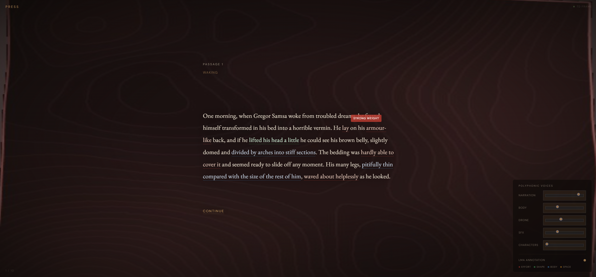
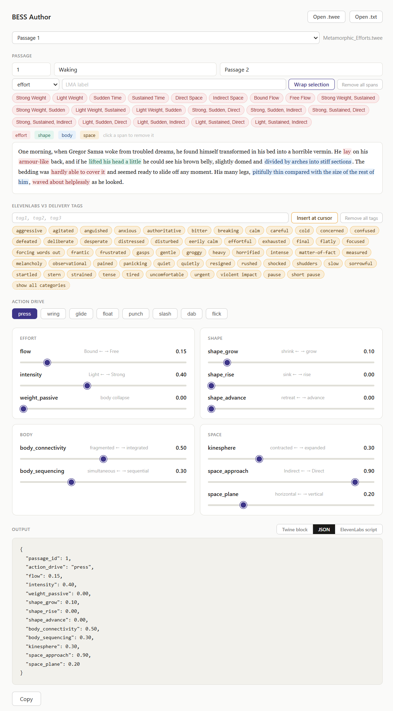
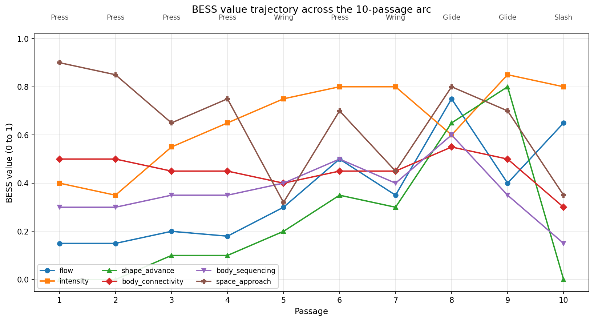
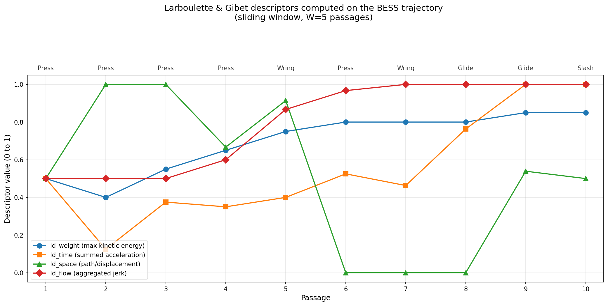

# Metamorphic Efforts: Visualizing Laban Movement Qualities from Kafka's *The Metamorphosis*

**Steffen Møgelmose**
smogel22@student.aau.dk
Department of Architecture, Design and Media Technology, Aalborg University Copenhagen, Denmark

*Embodied Interaction Mini-Project, MED8, Spring 2026*



**Figure 1:** Running piece on Passage 1 (Press), showing the domed visual texture, LMA annotation overlay, and the polyphonic voices mixer panel.

## Abstract

This project presents a generative audiovisual system that translates the opening passages of Kafka's *The Metamorphosis* into an interactive embodied audiovisual experience. Using manual Body, Effort, Shape, and Space (BESS) annotations grounded in Laban Movement Analysis, the system interprets kinesthetic details in the prose and maps them to a single visual field and a five-layer polyphonic audio output. Computable Effort descriptors adapted from motion-analysis literature continuously modulate the visual system, while Drive-level emotional correlates inform audio selection. The project argues that kinesthetically dense literary prose can serve as a viable input modality for effort-driven embodied-interaction systems, alongside performed movement.

## Keywords

Laban Movement Analysis, Effort, BESS, embodied interaction, motor simulation, generative audiovisual, TouchDesigner, ElevenLabs, Twine, Kafka.

## 1. Introduction

Embodied-interaction systems typically regard embodiment as physiological sensing, gesture, or gross motor movement. The system reacts to the user's bodily movements. This project starts with a different idea: reading literary prose about embodied experience is itself an embodied act, and prose with enough kinesthetic density can be used as a source of effort data like a moving body.

The empirical foundation is found in cognitive linguistics. The reader's sensorimotor system is activated through motor simulation when action-related sentences are read. According to Tettamanti et al. [11], the premotor cortex is somatotopically activated by listening to action-related sentences. The corresponding motor regions exhibit distinct activations in the mouth, hand, and leg regions. This is expanded upon in a general theory of language comprehension as embodied simulation by Gallese and Lakoff [4] and Zwaan [12]. When Kafka describes that Gregor's legs "waved about helplessly," the reader does more than just figure out what the words mean; their motor system partially recreates the helpless movement of the legs.

Kafka's *The Metamorphosis* is a particularly good candidate for this method. Body struggle is the primary focus of each paragraph. Ordinary actions like rolling, lifting a head, and opening a door are transformed into described kinesthetic events. According to Beck [1] and Pawel [9], Kafka's fascination with Yiddish theater derived from its distinctive combination of speech, gesture, and embodied vocal performance. His continuous association with a troupe in the years before *The Metamorphosis* also implies a developing relationship between literary imagination and bodily experience. Embodied reading triggers motor simulation in the reader's sensorimotor system, generating bodily activation alongside semantic processing. Multimodal output builds on this by reshaping the text's encoded Effort qualities, linking perception, language, and embodiment through a single framework.

This project explores whether high-kinesthetic-density literary prose can serve, alongside performed bodily movement, as an Effort input modality for embodied-interaction systems. Motor-simulation theories of language comprehension are used to explain how reading sentences about actions activates the reader's sensorimotor system, making textual descriptions a plausible carrier of movement qualities. The contribution is methodological: a functional pipeline that extends the input set for Effort-driven systems by converting BESS annotations of Kafka's *The Metamorphosis* into a generative audiovisual rendering.

**Live demo:** [mogelmose.org/Embodied-interaction](https://mogelmose.org/Embodied-interaction/Metamorphic_Efforts.html?ws=wss://embodied-interaction.onrender.com/ws?role=browser) (requires TD session online; see [walkthrough video](https://vimeo.com/1187075793) otherwise)

## 2. Related Work

Four earlier works serve as groundwork for the project. The main reference establishes the pipeline structure; the others offer theoretical support for emotion mapping and parameter computing.

### 2.1 Main reference: Fdili Alaoui et al. [3]

In their study, Fdili Alaoui et al. look into how LMA can be modeled computationally by adding movement knowledge to multimodal sensing. In collaboration with certified LMA practitioners, the authors develop feature sets from physiological, positional, and dynamic sensor data that correspond to the perceptions of experts regarding the four Effort factors (Weight, Time, Space, Flow). Their key conclusion is that combining several data modalities produces a much better description of effort than using just one. The paper is phenomenologically based on Merleau-Ponty [8] and Dourish [2]. The above paper states that computational systems should address movement as a lived, expressive phenomenon more than as functional input.

With this project, the input modality is switched from physical performance to literary prose, while the pipeline structure remains BESS annotation as structured input, with Effort factors as the parameterization, and generative audiovisual output as the rendering. The visual field and five-layer audio design are driven by this multi-modal principle.

### 2.2 Computable Effort descriptors: Larboulette and Gibet [6]

Larboulette and Gibet present the effort descriptors as algorithmic functions: flow is defined as aggregated jerk, time as summed acceleration, space as path-to-displacement ratio, and weight as maximum kinetic energy over a window. This project uses these algorithms on the BESS annotation trajectory, which is computed in JavaScript on a sliding window of the last five passages and then sent to TouchDesigner with the BESS payload. The descriptor implementation is reproducible via the Python script `generate_report_figures.py` in the repository.

### 2.3 Effort-to-emotion attribution: de Meijer [7]

De Meijer ran a study in which 85 naive observers evaluated 96 systematically varied body movements. Laban's weight, time, and space are analogous to three of his seven dimensions: force, velocity, and directness. From feature combinations, regression analysis predicted emotion categories; factor analysis extracted three underlying factors: Rejection-Acceptance, Withdrawal-Approach, and Preparation-Defeatedness. In this project, the emotional correlates at the Drive level (Press to determination, Wring to grief, Glide to calm focus, Slash to fear) are conceptual applications of De Meijer's regression findings, instead of direct empirical mappings, as he did not directly test Action Drives.

### 2.4 Structural comparator: Ghostdance [10]

Siopa et al. offer the most comparable structural study. Using an LSTM classifier, Ghostdance extracts Action Drives from a live dancer's IMU data and sends them to VR spatial audio and Unity particle presets. Action Drives serve as preset selectors in both projects, altering the state of every output modality simultaneously. The primary difference is the input channel: Ghostdance employs a live body, while this project employs literary prose. The parametric framework is achieved by the two projects from opposing perspectives, one body-first and one text-first.

| | Ghostdance | Metamorphic Efforts |
|---|---|---|
| Movement input | Live dancer (IMU sensors) | Literary prose (close reading) |
| Effort extraction | Real-time LSTM classification | Manual BESS annotation |
| Output medium | Unity particles in VR | TouchDesigner + ElevenLabs in browser |
| Interaction model | Dancer performs, audience watches | Viewer reads, system responds |
| Temporal control | Continuous, dancer-driven | Hybrid, viewer-paced |

## 3. Theoretical Framework

Merleau-Ponty [8] provides the phenomenological foundation, which posits that perception is an active bodily interaction with the world, rather than a passive registration of stimuli. Action and perception are linked: you can't see without a body that can see. This is translated into interaction design by Dourish [2] using the embodied interaction principles, which state that systems should interact with the entire spectrum of human abilities and capacities for action, including the expressive, improvisational, and qualitative aspects of bodily experience.

The project uses LMA's descriptive system to parameterize movement quality. Movement observation by LMA is broken down into four groups: Body, Effort, Shape, and Space (BESS). Four components make up the dynamic, qualitative structure of movement: Time (Sudden/Sustained), Space (Direct/Indirect), Weight (Strong/Light), and Flow (Bound/Free). Laban's eight Action Drives: Press, Flick, Punch, Float, Wring, Dab, Slash, Glide are the result of the combination of the three factors, except Flow, in pairs. Shape describes the way the body changes shape in three dimensions, such as expanding or contracting, rising or sinking, or moving forward or backward. The mover's body describes how its parts are organized structurally (which parts lead and which parts follow, how movement happens). Space provides insight about how the mover interacts with its surroundings (kinesphere, dominant plane, attentional focus).

The core idea is that these classifications combine to form a single embodied experience. A Press is a felt quality instead of three distinct constructs (Strong, Sustained, and Direct). This integration is demonstrated in the project by routing the same annotation to multiple polyphonic audio voices and rendering all BESS parameters through a single visual field instead of distinct layers.

A structural metaphor from Bakhtin's polyphony [13] is also used in the project. There are many voices of movement at once in Kafka's writing, such as Gregor's heavy pressing body, the clock's steady ticking, the mother's unclear knock, and the rain on the window. This creates a polyphonic texture rather than resolving into a single Effort. It works on three multimodal stages: the source text with multiple movement voices per passage, the system output with five overlapping audio channels sharing a harmonic drone, and the methodology as single-analyst annotation as narrative voice. This is a metaphorical use more than strict Bakhtinian.

## 4. Method

### 4.1 Pipeline

The system runs the following pipeline:

```
text → close reading → BESS annotation → Action Drive + descriptors
                                            ↓
                     TouchDesigner ←─── BESS payload (WebSocket)
                                            ↓
            browser canvas ←─── JPEG frames (WebSocket)
                                            ↓
       5 audio layers (Web Audio API): narration · body vox · drone · SFX · characters
```

Each passage is annotated for Body, Effort, Shape, and Space using a normalized 0-1 value. Laban's eight Action Drives are comprised of the three Effort factors, with the exception of Flow. Flow modulates as a continuous overlay. In the 10 passages, four Drives are put to use: Press (P1-4, P6), Wring (P5, P7), Glide (P8-9), and Slash (P10).

### 4.2 BESS annotation

To author the 53 annotation spans in the source, a custom browser tool, `bess_author.html`, was developed (see Figure 2). The tool loads the Twine .twee source, enables the analyst to select text spans and tag them with the BESS category, configure the Action Drive and BESS slider values per passage, and creates Twine-ready markup or JSON.



**Figure 2:** BESS Author tool, showing Passage 1 annotation: span tagging in the text body, Action Drive selector, BESS sliders, and JSON output.

### 4.3 Worked example: Passage 1

Passage 1 (Gregor waking, transformed) is annotated as follows:

- action_drive: `press`
- flow: 0.15 (tightly Bound)
- intensity: 0.40 (moderate)
- shape_grow: 0.10, shape_rise: 0.00, shape_advance: 0.00
- body_connectivity: 0.50, body_sequencing: 0.30
- kinesphere: 0.30, space_approach: 0.90 (highly Direct), space_plane: 0.20

The Action Drive Press results from Strong Weight (the armour-like back, the inability to move freely), Sustained Time (he lay, he lifted slowly), and Direct Space (attention focused on his own transformed body). Flow is tightly Bound: every described action can be started and stopped. The interpretive emotional correlate after de Meijer [7] is determination and heaviness.

## 5. System Architecture

Twine (SugarCube) functions as a single browser interface, combining text, audio, and images into a single display. TouchDesigner functions as a headless visual generator that receives BESS payloads and transfers JPEG frames via WebSocket. Five polyphonic layers of audio with independent volume sliders for each layer are played from the browser via the Web Audio API. The TouchDesigner network is shown in Figure 3.


**Figure 3:** TouchDesigner network with the WebSocket DAT connected to the Render relay. Live BESS values for Passage 1 visible in the right column, noise/feedback/color processing chain in the centre, frame_sender Execute DAT streaming JPEGs.

The system runs in two configurations.

**Local development.** TouchDesigner and browser on the same machine. Direct WebSocket on `ws://localhost:9980`. Used during development:

```
TWINE (browser, localhost:8080)
  |  Kafka text + LMA annotation overlay
  |  5 audio layers (Web Audio API)
  |  Canvas shows TD visual frames
  |
  |  ws://localhost:9980  (BESS JSON --->)
  |  (<--- JPEG frames)
  |
TOUCHDESIGNER (same machine, headless)
```

**Deployed.** Browser hosted on GitHub Pages at `mogelmose.org/Embodied-interaction/`. TouchDesigner runs on the artist's machine. A small Node relay on Render at `embodied-interaction.onrender.com/ws` matches them by `?role=browser` and `?role=td` query parameters:

```
TWINE (browser, role=browser)
        |
        |  wss://embodied-interaction.onrender.com/ws
        v
RENDER RELAY (Node, backend/)
        ^
        |  wss://embodied-interaction.onrender.com/ws
        |
TOUCHDESIGNER (artist's machine, role=td)
```

## 6. Mappings

Each of the seven cross-modal mappings in the system is based on a distinct source contribution:

| Source | Contribution | Where it appears |
|---|---|---|
| Fdili Alaoui et al. [3] | Pipeline structure; multi-modal Effort principle | Overall architecture; 5 audio layers + visual field |
| Larboulette and Gibet [6] | Computable Effort-to-parameter formulas | Visual preset; runtime descriptor modulation |
| de Meijer [7] | Effort-to-emotion regression findings | TTS audio tag selection per passage |
| Siopa et al. [10] | Action Drive preset-selector architecture | Visual preset switching; cross-modal state |

### 6.1 Visual field

By modulating a single continuous noise/feedback/color texture, TouchDesigner avoids rendering each BESS category as a distinct visual layer. The following formulas show how each Effort factor is related to a noise parameter: Weight is related to noise amplitude and period; Time is related to animation speed; Space is related to blur and zoom; Flow is related to feedback decay. Every Action Drive stores a visual preset. When the Drive changes, the preset is loaded, and the parameters move smoothly toward their new targets. The four computed descriptors ld_weight, ld_time, ld_space, ld_flow, modulate transition behavior continuously.

### 6.2 Polyphonic audio

The five audio layers express different movement voices:

- **Narration**: Kafka's text via ElevenLabs v3 TTS (Bradford voice). Per-passage audio tags follow de Meijer-derived emotional correlates. For Wring at P7: `[desperate, frantic], [panicked]`. For Glide at P8: `[calm, measured], [quiet, deliberate]`. For Slash at P10: `[aggressive, urgent], [exhausted, defeated], [flatly, final]`.
- **Body vocalisation**: Gregor's somatic voice as non-verbal breath, gasps, strain. Strong+Sustained yields heavy exhales; Sudden yields gasps; Bound yields constricted throat.
- **Drones**: per-Drive 60-second loops generated via ElevenLabs Music Generation, providing a sustained atmospheric ground.
- **SFX**: clock ticks (Sustained, Bound), knocks (Sudden, Direct), body scraping (Strong, Sustained), door slams (Sudden, Strong).
- **Characters**: external movement voices from P4 onward (mother's call, manager's footsteps, father's hissing, stomping, weeping). Each character has its own assigned Effort quality.

A default mix per passage sets opening volumes; users can override any layer with the on-screen sliders.

## 7. Results

The BESS annotation generates a trajectory of six informative channels that spans the 10 passages (Figure 4). Flow rises from 0.15 (tightly Bound at P1-2) to a peak of 0.75 at P8 (the coordinated jaw-to-door effort), drops to 0.4 at P9 (the held door-opening moment), and ends at 0.65 at P10. Intensity climbs from 0.35 to a double peak of 0.8 at P6-P7, dips to 0.6 at P8, surges to 0.85 at P9, holds at 0.8 for Slash. Shape_advance climbs from 0.0 through 0.5 (getting out of bed) to 0.8 (reaching through the open door) and crashes to 0.0. Space_approach starts very high (0.9) and trends downward to 0.35 by P10.



**Figure 4:** BESS value trajectory across the 10-passage arc.

The four Larboulette and Gibet descriptors that were computed on the BESS trajectory using a five-passage sliding window are illustrated in Figure 5. ld_weight rises steadily as the piece builds toward the confrontation. ld_time peaks sharply at P9-P10 where intensity reaches its peak and Effort quality shifts most abruptly. ld_flow rises as annotated Flow values become less smooth from P5 onward. ld_space drops to 0 through the middle of the piece and recovers near the end.



**Figure 5:** Larboulette and Gibet descriptors computed on the BESS trajectory using a five-passage sliding window.

## 8. Discussion

This system demonstrates that effort-driven generative systems can use literary texts with dense kinesthetic information as a foundation for annotations. The Larboulette and Gibet formulas that underpin the visual parameterization are the same formulas that are typically employed with motion capture data; the only distinction is in the data source. For Effort-driven embodied-interaction systems, this expands the set of inputs beyond performed movement.

In a way that the text alone cannot express, the polyphonic audio architecture made Kafka's prose multi-voice character audible; by lifting and muting individual layers, one can see which voices carry which Effort qualities at each passage. The use of de Meijer-derived emotional correlates of Effort constellations to direct ElevenLabs v3 TTS via audio tags is a novel approach. The voice not only reads the text, but also performs the Effort quality of the text.

The proposed assertion that text is a movement base is restricted. Not every piece of prose meets the criteria. In Kafka's writing, every paragraph focuses on physical struggle. Texts that are mostly about internal monologue or psychological abstraction would not make it possible to track effort in the same way.

## 9. Limitations

There is no inter-rater reliability check; the annotation is single-analyst only. The computational models of Fdili Alaoui et al. [3] were trained using certified LMA practitioner annotation as ground truth. This project would be enhanced by substituting the author's annotation with that of a certified practitioner, preferably with multiple annotators to facilitate inter-rater agreement.

De Meijer's mapping of drive to emotion is interpretive rather than empirical. In his tests, De Meijer looked at combinations of Effort features instead of Action Drives. Because Drives are built using the precise dimensions de Meijer measured, the associations used here are believable; however, the routing is interpretation rather than quantification.

The ld_flow descriptor is calculated from the jerk of the annotated flow channel, which means that it measures the meta-variability of the channel rather than the Flow Effort of the described movement directly. In a sensor-based implementation, ld_flow would be calculated by summing the jerk of position data across all axes.

Audio employs Effort as a design-time curation principle for asset selection, including the selection of particular audio tags, body vox files, and drone loops, rather than as a runtime control signal. It is only the visual layer that is continuously runtime-modulated by descriptors. Visual and audio modulation that are symmetrical is a viable direction for the future.

Instead of being a closed loop, the system is a forward chain, meaning that the viewer's physical condition has no bearing on it. A version that completes this loop through psychophysiological measurements would more fully realize Dourish's [2] embodied-interaction principle.

## 10. Future Work

A two-condition listener study should be used to confirm perceived effort. The method should also be tested on different texts that are kinesthetically dense, and the audio modulation should respond in real time to match the visual system.

## 11. AI Tool Use

Anthropic Claude (LLM) was implemented by the author for the purpose of organizing the project, reviewing the code, and editing the supporting documents for Notion and Linear. Narration, body vocalization, drones, and sound effects were all made with ElevenLabs (Pro). VSCode (IDE) was used for code debugging and for backend infrastructure. The project's methodological choices, theoretical framing, and BESS annotation did not make use of these tools.

## 12. Conclusion

Metamorphic Efforts is a project that shows a generative audiovisual system that turns the first part of Kafka's *The Metamorphosis* into a real-time embodied interaction experience based on the qualities of Laban Movement Analysis Effort. By putting the moving body in literary prose instead of a performed body, the project shows that kinesthetically dense literary text can be used as a base for annotations in effort-driven generative systems. The integrated visual field and the five-layer polyphonic audio work together to show the same Effort trajectory in different ways. The primary limitation is that the system is a forward chain rather than a closed loop, and the annotation is single-analyst. However, both aspects can be addressed in future research. The assertion is methodological in nature, as it extends the input set for Effort-driven embodied-interaction systems to include kinesthetically dense literary prose in addition to performed movement.

## References

[1] Beck, E. T. (1971). *Kafka and the Yiddish Theater: Its Impact on His Work.* University of Wisconsin Press.

[2] Dourish, P. (2004). *Where the Action Is: The Foundations of Embodied Interaction.* MIT Press.

[3] Fdili Alaoui, S., Francoise, J., Schiphorst, T., Studd, K., & Bevilacqua, F. (2017). Seeing, Sensing and Recognizing Laban Movement Qualities. In *Proceedings of the 2017 CHI Conference on Human Factors in Computing Systems* (CHI '17), 4009-4020.

[4] Gallese, V., & Lakoff, G. (2005). The brain's concepts: The role of the sensory-motor system in conceptual knowledge. *Cognitive Neuropsychology*, 22(3-4), 455-479.

[5] Kafka, F. (1915). *The Metamorphosis.* (D. Wyllie, Trans., Project Gutenberg edition).

[6] Larboulette, C., & Gibet, S. (2015). A Review of Computable Expressive Descriptors of Human Motion. In *Proceedings of MOCO '15*.

[7] de Meijer, M. (1989). The contribution of general features of body movement to the attribution of emotions. *Journal of Nonverbal Behavior*, 13(4), 247-268.

[8] Merleau-Ponty, M. (1945/2002). *Phenomenology of Perception.* Routledge.

[9] Pawel, E. (1984). *The Nightmare of Reason: A Life of Franz Kafka.* Farrar, Straus and Giroux.

[10] Siopa, A. et al. (2024). Ghostdance. In *Proceedings of MOCO '24*.

[11] Tettamanti, M. et al. (2005). Listening to action-related sentences activates fronto-parietal motor circuits. *Journal of Cognitive Neuroscience*, 17(2), 273-281.

[12] Zwaan, R. A. (2004). The immersed experiencer: Toward an embodied theory of language comprehension. *Psychology of Learning and Motivation*, 44, 35-62.

[13] Bakhtin, M. M. (1984). *Problems of Dostoevsky's Poetics* (C. Emerson, Ed. & Trans.). University of Minnesota Press.


---

## Appendix: Installation and Running

### Requirements

- **Python 3.8+** for the local HTTP server
- **TouchDesigner 2023.x or later** (free non-commercial licence sufficient): https://derivative.ca/download
- **A modern browser** with Web Audio API and WebSocket support

### Setup

```
git clone https://github.com/smogelmose/Embodied-interaction.git
cd Embodied-interaction
```

### Running locally

The system requires three components running simultaneously: TouchDesigner (visual generator), a local HTTP server (browser host), and the browser tab itself.

1. **Start TouchDesigner.** Open `Metamorphic_Efforts.toe`. The Web Server DAT starts the WebSocket server automatically on port 9980, and the Execute DAT named `frame_sender` begins streaming JPEG frames at approximately 15 fps once a browser client connects.

2. **Start the local HTTP server** from the project root:

   macOS/Linux: `python3 -m http.server 8080`
   Windows: `start_server.bat` or `python -m http.server 8080`

3. **Open the browser** at `http://localhost:8080/Metamorphic_Efforts.html`.

### Running deployed

The deployed configuration uses GitHub Pages for the frontend (`docs/` folder, served at `mogelmose.org/Embodied-interaction/`) and a Render Node service (`backend/`) as the WebSocket relay. The frontend defaults to `wss://embodied-interaction.onrender.com/ws?role=browser`. TouchDesigner connects to the same URL with `?role=td`. The relay matches the two by role and forwards messages between them. No inbound port on the artist's machine is required.

### Optional tooling

`bess_author.html` is a self-contained browser tool for creating and editing BESS annotations on passage text. Open directly in any modern browser; no server required. It loads a `.twee` or `.txt` file, allows span tagging with BESS category and LMA label, supports per-passage Action Drive and ElevenLabs v3 voice tags, and outputs Twine-ready markup.

### License

Code is licensed under MIT. Creative content (BESS annotations, report, figures, generated audio, walkthrough video, system design) is licensed under CC BY-NC 4.0. The source text of *The Metamorphosis* (Wyllie translation, Project Gutenberg) is in the public domain.

### Repository

https://github.com/smogelmose/Embodied-interaction