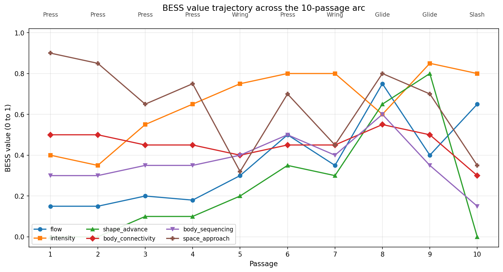
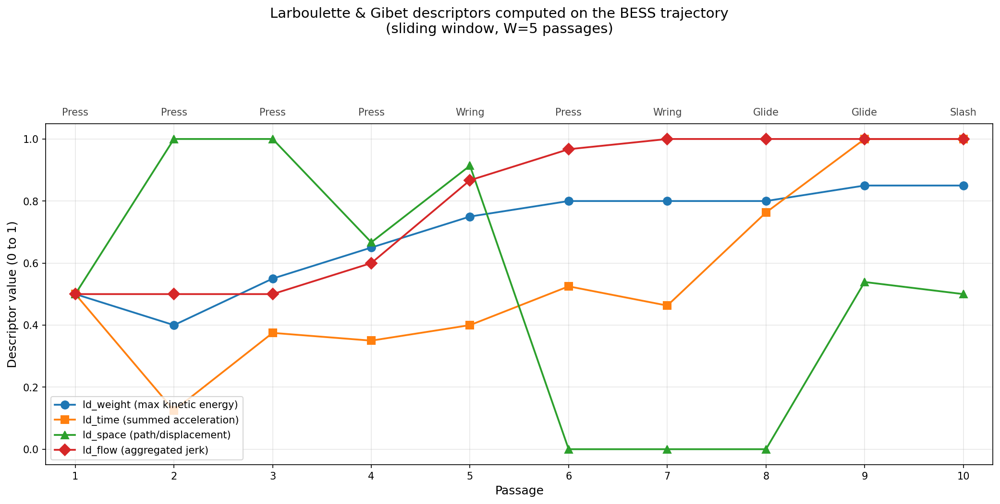

# Metamorphic Efforts: Visualizing Laban Movement Qualities from Kafka's *The Metamorphosis*

*Embodied Interaction Mini-Project - MED8, Aalborg University Copenhagen*

*Embodied polyphony: enacting the kinesthetic body of prose.*

This project treats literary prose as a kinesthetic body: a site of movement qualities that can be extracted, annotated, and rendered as embodied audiovisual experience. Where conventional LMA systems go from physical body to sensor to Effort classification, this project locates the moving body in literary text and reads it through the same pipeline: from textual body to close reading to BESS annotation to generative output.

The project argues three things. First, reading literary prose about embodied experience activates motor simulation in the reader's sensorimotor system, making the act of reading itself a bodily event rather than pure semantic decoding. Second, the viewer's temporal and attentional engagement with the text is the input that drives the system: the rhythm of reading, pacing, and attending is the "interaction" that triggers BESS transitions and audio events. Third, the multi-modal output converges on the same Effort qualities that the text encodes, amplifying the motor simulation already underway in reading. The viewer reads about heaviness while the visual field enacts heaviness and the voice performs heaviness; all three channels are driven by the same Effort analysis, so perception, text, and body are in sustained loop.

---

## Main Reference

**Fdili Alaoui, S., Francoise, J., Schiphorst, T., Studd, K., & Bevilacqua, F. (2017). "Seeing, Sensing and Recognizing Laban Movement Qualities." In *Proceedings of the 2017 CHI Conference on Human Factors in Computing Systems* (CHI '17). ACM, 4009-4020.**

### Review

Fdili Alaoui et al. investigate how Laban Movement Analysis (LMA) can be computationally modeled by integrating movement expertise into the design of multimodal sensing systems. Working with certified LMA practitioners, they design feature sets drawn from positional, dynamic, and physiological sensor data that correlate with how experts perceive Laban Effort qualities: Weight, Time, Space, and Flow. Their evaluation demonstrates that combining multiple data modalities yields significantly better characterization of Efforts than any single modality alone.

The paper's philosophy is phenomenological: following Merleau-Ponty and Dourish's *embodied interaction*, it argues that computational systems should engage with movement as a lived, expressive phenomenon rather than reducing it to functional input.

### Relevance to this project

Fdili Alaoui et al. establish the methodology for translating LMA expertise into computational models, designing sensor feature sets that correlate with how certified practitioners perceive Effort qualities. Their pipeline runs from body to sensors to Effort classification. This project locates the moving body in literary prose and reads it through the same parametric framework.

Larboulette & Gibet (2015) provide the computable formulas that formalize the Effort descriptors used in Fdili Alaoui and others: Weight as maximum kinetic energy over a time window, Time as summed acceleration, Space as the ratio of path length to displacement (directness), and Flow as aggregated jerk. The project implements these descriptors computationally on the BESS trajectory across passages. As the viewer progresses, the story JavaScript maintains a history of per-passage BESS values and computes the four descriptors over a sliding window. The computed values are sent to TouchDesigner alongside the raw BESS data and modulate visual parameters: the Action Drive preset anchors each passage's identity, while the descriptor values shape transition behavior (lag time, amplitude scaling). This grounds the parameterization in a genuine implementation of Larboulette & Gibet's formulas rather than a conceptual approximation.

De Meijer (1989) provides the empirical link between Effort and emotion. In a controlled experiment, 85 naive observers rated 96 body movements that were systematically varied across seven dimensions; three of those dimensions (force, velocity, directness) correspond to Laban's Weight, Time, and Space. Regression analysis found each emotion category predicted by a unique combination of features (R-squared .65 to .91); factor analysis extracted three underlying factors: Rejection-Acceptance, Withdrawal-Approach, and Preparation-Defeatedness. De Meijer did not test Laban Action Drives directly, so the Drive-to-emotion associations used in this project are interpretive applications of his regression findings rather than direct empirical mappings.

| Action Drive | Effort constellation | Interpretive correlate (after de Meijer) |
|---|---|---|
| Press | Strong + Sustained + Direct | Determination, heaviness |
| Wring | Strong + Sustained + Indirect | Grief, anguish |
| Punch | Strong + Sudden + Direct | Anger, desperation |
| Slash | Strong + Sudden + Indirect | Fear, chaos |
| Glide | Light + Sustained + Direct | Calm focus |

The visual and audio mappings in TouchDesigner are therefore parameterizations informed by de Meijer's empirical findings, with the interpretive step from regression-level data to Drive-level labels named explicitly rather than elided.

---

## Theoretical Framework

This project sits at the intersection of four theoretical positions: a phenomenology of embodied perception, the Laban Movement Analysis descriptive system, the empirical psychology of movement-to-emotion attribution, and a Bakhtinian polyphony of movement voices. Together they build the argument that kinesthetically dense literary texts encode Effort with sufficient density to serve as annotation substrate for Effort-driven generative systems, and that the resulting audiovisual output constitutes a form of embodied interaction.

### Embodied perception and the act of reading

The phenomenological foundation comes from Merleau-Ponty (1945/2002), for whom perception is active, bodily engagement with the world rather than passive registration of stimuli. Perception and action are co-constitutive: there is no seeing without the body that sees. Dourish (2004) translates this into interaction design with the concept of embodied interaction: systems should engage with the full range of human skills and capacities for action, including the qualitative, expressive, and improvisational dimensions of bodily experience. Most subsequent work in the field has interpreted "embodied" as gross motor movement, gesture, touch, or physiological sensing. This project extends the concept in a different direction.

Reading literary prose about embodied experience activates what cognitive linguists call motor simulation: the reader's sensorimotor system partially reproduces the movement patterns described in the text (Gallese & Lakoff, 2005; Zwaan, 2004). When Kafka writes that Gregor's legs "waved about helplessly," the reader does not merely decode semantic content; they undergo a kinesthetic event, a momentary activation of the motor programs and postural schemas associated with helpless limb movement. Neuroimaging evidence supports this: Tettamanti et al. (2005) showed that listening to action-related sentences activates the premotor cortex somatotopically, with mouth-, hand-, and leg-related sentences producing distinct activations in the corresponding regions of the motor system.

Kafka himself was attuned to this dimension of expression. His fascination with Yiddish theatre, encountered through a touring troupe from Lemberg in Prague in the winter of 1911-1912, centered on what he perceived as a union of spoken and bodily, gestural language (Pawel, 1984). Beck (1971) argues that this involvement shaped the dramatic, physically expressive style that emerged in Kafka's writing from 1912 onward, including *The Metamorphosis*. The kinesthetic precision in the text is consistent with a sensibility already oriented toward the expressive body as a site of meaning.

The viewer's temporal and attentional engagement with Kafka's prose is the embodied input that drives the system. The Effort qualities encoded in the text are re-enacted in the reader's kinesthetic imagination as they read, and simultaneously rendered in the visual and sonic output. The three channels (text, image, sound) converge on the same movement quality, amplifying the motor simulation that the reading already initiates.

### Laban Movement Analysis: the BESS framework

LMA provides the descriptive system through which the project parameterizes movement quality. Developed by Rudolf Laban and extended by subsequent practitioners (Laban & Ullmann, 1971; Bartenieff, 1972; Hackney, 2002), LMA organizes movement observation into four categories known as BESS: Body, Effort, Shape, and Space.

**Effort** describes the dynamic, qualitative texture of movement through four factors: Weight (Strong/Light, the mover's relationship to gravity and force), Time (Sudden/Sustained, the sense of urgency), Space (Direct/Indirect, attentional focus), and Flow (Bound/Free, the continuity and controllability of movement). The three factors excluding Flow combine in pairs to produce Laban's eight Action Drives (Press, Flick, Punch, Float, Wring, Dab, Slash, Glide), each naming a distinct movement quality.

**Shape** describes how the body changes form in three-dimensional space: growing or shrinking, rising or sinking, advancing or retreating.

**Body** describes the structural organization of the mover: which body parts initiate and follow, how movement sequences through connected segments (sequencing), and how well the core integrates peripheral action (connectivity). Hackney (2002) elaborates these as Patterns of Total Body Connectivity.

**Space** describes the mover's relationship to the spatial environment: the kinesphere, the dominant spatial plane, and the quality of spatial attention.

The critical claim is that these categories co-constitute a single embodied experience. A Press is not three separate facts (strong + sustained + direct) but one felt quality. The project preserves this integration by rendering all BESS parameters through a single visual field rather than separate layers.

### Computational grounding

Larboulette & Gibet (2015) formalize the BESS descriptors as computable functions. Weight is the maximum kinetic energy over a time window. Time is summed acceleration. Space is the ratio of path length to displacement. Flow is aggregated jerk. This project implements these formulas on the BESS annotation trajectory: as the viewer progresses, the story JavaScript computes the four descriptors over a sliding window of recent passages and sends the computed values to TouchDesigner alongside the raw BESS data. The descriptor values modulate visual parameters in real time: the preset lookup sets the target state for each Action Drive, and the descriptor values shape how the system transitions toward that target.

### Polyphony

Bakhtin (1984) describes polyphony as a novelistic structure in which multiple independent consciousnesses coexist without being subordinated to a single authorial voice. While Kafka's third-person narration is not polyphonic in the strict Bakhtinian sense, the concept becomes productive when applied to movement quality rather than consciousness. Kafka's prose contains multiple simultaneous movement voices: Gregor's heavy Pressing body, the clock's metronomic ticking, the mother's knock, the rain on the window. These voices do not resolve into a single Effort; they form a polyphonic texture.

The polyphonic frame operates at three levels: the source text (multiple movement voices per passage that the single-annotation approach captures only partially), the system output (five simultaneous channels sharing a harmonic ground but moving at different temporal rates), and the methodology (single-analyst annotation as one legitimate interpretive voice among possible others).

---

## Analysis: From Motion to Emotion

### The pipeline: locating movement in literary prose

The conventional LMA pipeline runs from a moving body through sensors to computational Effort classification. This project locates the moving body in literary text. Kafka's prose encodes physical struggle in precise kinesthetic language, and the pipeline becomes: text to close reading to BESS annotation to generative audiovisual output.

**Step 1: Close reading as movement extraction.** Each of the 10 passages in the opening section of *The Metamorphosis* was read for its dominant kinesthetic content. Textual cues map onto the four Effort factors.

**Step 2: BESS annotation and Action Drive assignment.** Each passage was annotated across four BESS categories using the computable definitions from Larboulette & Gibet. The three Effort factors excluding Flow combine into one of Laban's eight Action Drives, which name the dominant movement quality of each passage. Flow then acts as a continuous modifier layered on top.

The 10 passages use four of the eight Action Drives:

- **Press** (Strong, Sustained, Direct): passages 1 through 4 and 6. Gregor's heavy, slow, focused physical struggle. Determination under weight.
- **Wring** (Strong, Sustained, Indirect): passages 5 and 7. The same heaviness and slowness, but attention scatters. Anguish, loss of control.
- **Glide** (Light, Sustained, Direct): passages 8 and 9. Passage 8: Gregor reaches the door with focused, gentle movement. Passage 9: the held moment as the door opens, with external agents (clerk retreating, mother sinking, father clenched and weeping) supplying intrusive energies around Gregor's sustained, Bound movement.
- **Slash** (Strong, Sudden, Indirect): passage 10. The father drives Gregor back. Violent, fast, unfocused collapse.

Unused: Punch, Flick, Float, Dab. These are defined in the preset table for completeness and possible extension to other texts.

**Step 3: Effort-to-emotion attribution via de Meijer (1989).** Each Action Drive has an interpretive emotional correlate informed by de Meijer's regression findings on 96 body movements rated by 85 naive viewers. The three underlying factors extracted by de Meijer (Rejection-Acceptance, Withdrawal-Approach, Preparation-Defeatedness) map onto the emotional arc of the opening section. De Meijer did not test Action Drives directly, so these are interpretive applications of his results.

### Methodological note: annotation as structured expert judgment

The BESS values in this project are manual qualitative annotations, not sensor-derived measurements. The analyst reads each passage, identifies kinesthetic cues in the text, and assigns normalized values on a 0-1 scale guided by the Larboulette & Gibet computable definitions as a conceptual frame.

This is consistent with established practice in LMA research. Fdili Alaoui et al. (2017) use certified LMA practitioner annotation as their ground truth for training computational models; de Meijer (1989) used naive viewer ratings. In both cases the authoritative source is trained human perception, not automated classification. The difference here is that the "movement" being perceived is encoded in literary language rather than performed by a body, and the annotation is carried out by a single analyst. There is no inter-rater reliability check, which is a limitation the planned user study addresses.

Three constraints keep the annotation internally consistent. Action Drive assignments are categorical (each passage is one of eight named Effort combinations). Continuous BESS values are assigned relative to each other across the 10-passage arc, not in isolation: a value of 0.0 for shape_advance in Passage 1 means "no sagittal reach relative to the maximum in Passage 9 (0.8)." Every value must be traceable to specific textual evidence.

### Polyphonic reading

**Passage 1** is close to monophonic. Gregor is alone with his body. The only non-Gregor movement is the bedding. The Press assignment loses very little.

**Passage 4** (Clock strikes, mother knocks) is where polyphony becomes audible. Three movement voices are active: Gregor's body (still Pressing), the environment (clock Sustained, rain Light), and the mother's knock (Sudden, Direct, ambiguous Weight). The dread emerges from counterpoint.

**Passage 7** (Manager's speech) is the densest passage. Gregor's desperate Wring runs against the manager's Dab-like authoritative speech rhythm. The shame emerges from a light, precise, direct external pressure bearing down on a heavy internal collapse.

**Passage 9** (The door opens) is a held moment. Gregor's movement is sustained and Bound; external agents supply intrusive energies (clerk retreating, mother sinking, father clenched, father weeping). The passage's high intensity comes from the event and the surrounding Efforts, not from Gregor. The charged Slash energy that is loading up here discharges in P10.

**Passage 10** returns toward monophony, but inverted. The father's Slash overpowers Gregor entirely. Gregor's body is no longer the dominant mover; he is being moved.

**How the system output restores polyphony.** Five output channels operate as independent voices sharing a harmonic ground: narration (literary voice), body vocalization (Gregor's somatic voice), drones (environmental), SFX (incidental voices), and visuals (integrated BESS field).

### Worked example: Passage 1

> One morning, when Gregor Samsa woke from troubled dreams, he found himself transformed in his bed into a horrible vermin. He lay on his armour-like back, and if he lifted his head a little he could see his brown belly, slightly domed and divided by arches into stiff sections. The bedding was hardly able to cover it and seemed ready to slide off any moment. His many legs, pitifully thin compared with the size of the rest of him, waved about helplessly as he looked.

**BESS annotation:** action_drive: `press`; flow: 0.15; intensity: 0.4; shape_grow: 0.1, shape_rise: 0.0, shape_advance: 0.0; body_connectivity: 0.5, body_sequencing: 0.3; kinesphere: 0.3, space_approach: 0.9, space_plane: 0.2.

**Action Drive: Press.** Strong (Gregor's body carries literal weight: the armour-like back, the stiff sections, the inability to move freely). Sustained (he *lay*; he *lifted* slowly; his legs *waved*). Direct (attention converges on a single object: his own transformed body).

**Flow: 0.15 (tightly Bound).** Every described action can be started and stopped; nothing spills. "Lifted his head a little" is deliberately restrained. "Waved helplessly" sounds Free but is actually low in amplitude; the legs are waving within a bounded kinesphere, without propulsive release.

**Intensity: 0.4.** Moderate bodily engagement. Gregor is awake and active but not straining. The legs wave, the head lifts, but there is no forceful exertion yet.

**Shape values.** `shape_grow: 0.1` because Gregor is not expanding; he is contained by the bedding. `shape_rise: 0.0` because he is horizontal, lying flat, only a minimal head-lift. `shape_advance: 0.0` because he has not moved forward.

**Body values.** `body_connectivity: 0.5` (moderate core integration). His belly is "divided by arches into stiff sections," the legs are described as separate from "the rest of him." He has some core awareness but his body is not functioning as an integrated unit. `body_sequencing: 0.3` (low). Head-lift does not flow into torso curl. Leg-waving does not propagate into the trunk. Each body part acts in isolation.

**Space values.** `kinesphere: 0.3` (small reach space). Gregor is lying on his back in bed, his reachable space limited to the volume directly around his torso. `space_approach: 0.9` (highly Direct). His attention is self-directed: own belly, own legs, own bedding. Near-maximum directness. `space_plane: 0.2` (predominantly horizontal, but barely registering).

**Interpretive correlate (after de Meijer).** Strong/Sustained/Direct maps to determination and heaviness on the Rejection-Acceptance axis. The passage's emotional signature is not despair or fear but the specific quality of bearing something heavy with focused attention. Press.

### BESS value trajectory across the 10-passage arc

The figure below shows the six most-informative BESS channels across the 10 passages, with Action Drives labelled above. Flow rises from 0.15 (tightly Bound, passages 1 to 2) to a peak of 0.75 (most Free, passage 8: the coordinated jaw-to-door effort), then drops through 0.4 at P9 (the held door-opening moment) to 0.65 at P10 (final collapse). Intensity climbs from 0.35 to a double peak of 0.8 at passages 6 to 7, dips for Glide at P8 (0.6), surges to 0.85 at P9 as the door opens and the family reacts, and holds at 0.8 for Slash. Shape_advance climbs from 0.0 through 0.5 (getting out of bed) to 0.8 (reaching through the open door), then crashes to 0.0. Body_sequencing peaks at 0.6 during Glide at P8, reflecting the coordinated jaw-to-door effort, and drops to 0.15 for Slash. Body_connectivity declines from 0.5 to 0.3 as Gregor's body becomes less coherent. Space_approach starts very high (0.9) and trends downward to 0.35 by P10. Kinesphere expands from 0.3 to 0.6 at the door scene and then contracts sharply.



The emotional arc emerging from these values follows from the Effort constellations that de Meijer's regressions and factor structure associate with each attribution.

### Computed Larboulette & Gibet descriptors

The project implements the Larboulette & Gibet (2015) computable descriptors as a running computation on the BESS trajectory. The `ME.computeDescriptors` function runs over a sliding window of recent passages (W=5) and returns four values that are appended to the BESS payload sent to TouchDesigner.



`ld_weight` (max intensity over the window) rises steadily as the piece builds toward the confrontation, matching the intuition that kinetic energy accumulates through the arc. `ld_time` (mean absolute delta) peaks sharply at passages 9 and 10 where intensity reaches its peak and Effort quality shifts most abruptly (Glide to Slash). `ld_flow` (aggregated jerk of the flow channel) rises as annotated Flow values become less smooth from passage 5 onward. `ld_space` drops to 0 through the middle of the piece because space_approach oscillates across the window (a high path-to-displacement ratio indicates Indirect motion), then recovers as the trajectory stabilises near the end. The descriptors are read values from the running system, not hand-drawn curves.

Worth naming honestly: `ld_flow` is computed from jerk of the annotated flow trajectory itself, so it measures meta-variability in the Flow channel rather than the Flow Effort of the described movement directly. In a sensor-based implementation `ld_flow` would be computed from the jerk of position data across all axes; here the Flow channel is the input substrate, so the descriptor is second-order. This is acceptable for the sliding-window modulation role it plays in the system (shaping visual transition behavior), but it is not a direct substitute for sensor-based aggregated jerk.

---

## Implementation

### Scope

The project focuses on the opening section of *The Metamorphosis*, from Gregor waking to the door being slammed shut after his first confrontation with his family. Ten key passages trace the Effort arc. Text is excerpted at narrative turning points where Effort qualities shift. Twine presents them as a continuous viewer-paced flow.

### Design choice: Twine as narrative control layer

The viewer reads Kafka's prose in a Twine story (SugarCube format) in a single browser window. Text, audio, and visuals are integrated in that window. TouchDesigner runs headless on the same machine, generating abstract visuals and streaming JPEG frames back to the browser via WebSocket, where they are rendered on a canvas element behind the text. Each Twine passage sends BESS/Effort data to TD via WebSocket on passage transition and receives the visual stream in return.

This design is grounded in the phenomenological framework. By making the viewer's act of reading the temporal driver of the system, the piece treats reading as an embodied, attentional act rather than a passive reception of content.

### Design choice: Action Drives as preset selectors

The four Effort factors were initially parameterized as independent continua. This was revised in favor of the eight Action Drives for three reasons: fidelity to the text (Kafka's writing shifts movement quality in clusters, not one factor at a time); simpler parameterization (eight discrete visual presets with smooth crossfading, rather than four continuous axes); and legibility (saying "this passage shifts from Pressing to Wring" communicates immediately to anyone familiar with LMA).

| Action | Weight | Time | Space | Visual character |
|---|---|---|---|---|
| Press | Strong | Sustained | Direct | Heavy, slow, focused |
| Flick | Light | Sudden | Indirect | Fine, darting, scattered |
| Punch | Strong | Sudden | Direct | Heavy, explosive, focused |
| Float | Light | Sustained | Indirect | Delicate, drifting, diffuse |
| Wring | Strong | Sustained | Indirect | Heavy, slow, twisting |
| Dab | Light | Sudden | Direct | Delicate, quick, pinpointed |
| Slash | Strong | Sudden | Indirect | Heavy, explosive, scattered |
| Glide | Light | Sustained | Direct | Delicate, smooth, channeled |

### Design choice: BESS as single integrated field

Rather than rendering each BESS category as a separate visual layer, all four categories modulate a single continuous noise/feedback/color texture in TouchDesigner. The BESS analysis is preserved in full (every parameter is active) but rendered as one integrated atmospheric field.

| BESS parameter | What it modulates in the visual field |
|---|---|
| Effort (Action Drive preset) | Noise amplitude, period, speed, hue offset |
| Shape (grow/rise/advance) | Zoom, vertical offset, horizontal drift |
| Body (connectivity/sequencing) | Compositing coherence, transition sequencing |
| Space (kinesphere/approach) | Blur width, overall brightness |
| Flow | Feedback decay (Bound = fast decay, Free = slow decay) |

This approach is both theoretically coherent (BESS categories co-constitute a single embodied experience in lived movement) and practically robust (one visual system built well rather than four built partially). Implementation details for the Body layer are in `td_body_layer_build.md`.

### System architecture

```
TWINE (browser, single interface)
  |  Kafka text + LMA annotation overlay
  |  5 audio layers (Web Audio API)
  |  Canvas shows TD visual frames
  |  Viewer adjusts layer volumes (optional)
  |
  |  WebSocket text: BESS JSON --->
  |  <--- WebSocket binary: JPEG frames
  |
TOUCHDESIGNER (headless, same machine)
  [Web Server DAT] --> parser + preset callbacks --> value_lag + preset_lag
  noise1 --> comp1 (with feedback1/fb_decay loop, Over mode)
    --> space_blur --> space_zoom
    --> intensity_dim --> collapse
    --> final_out (Lookup + base_ramp/color_shift)
  frame_sender Execute DAT --> JPEG via WebSocket (~15fps)

AUDIO (browser, Web Audio API):
  masterGain --> narration | body_vox | drone | sfx | characters
```

### Mapping derivations

The generative system's mappings are derived from specific contributions in the reference literature.

**Fdili Alaoui et al. (2017): pipeline structure and multi-modal principle.** The project borrows the pipeline architecture itself (BESS annotation as structured input, Effort factors as the central parameterization, generative output as the rendering target) and transposes the input modality from physical performance to literary prose. Their finding that combining multiple data modalities characterizes Effort better than any single channel motivates the five-layer audio design and the integrated visual field.

**Larboulette & Gibet (2015): computable parameter mappings.** Their formalized Effort descriptors are implemented as running computations on the BESS annotation trajectory, described above.

**De Meijer (1989): Effort-to-emotion interpretive grounding.** The emotional arc of the piece is grounded in de Meijer's regression findings and three-factor structure rather than arbitrary labels, with Drive-level labels treated as interpretive applications.

**Siopa et al. (2024, Ghostdance): Action Drives as preset selectors.** The preset-selector architecture, where an Action Drive label triggers a coordinated cross-modal state change, comes directly from Ghostdance.

| Source | What it contributes | Where it appears |
|---|---|---|
| Fdili Alaoui et al. (2017) | Pipeline structure; multi-modal Effort expression | Overall architecture; 5 audio layers + visual field |
| Larboulette & Gibet (2015) | Computable Effort-to-parameter formulas | Visual preset (amp, period, speed, blur, zoom, feedback); running descriptors |
| De Meijer (1989) | Interpretive Effort-to-emotion grounding | Emotional arc; TTS vocal tag selection |
| Siopa et al. (2024) | Action Drive preset-selector architecture | TD preset lookup; coordinated cross-modal state changes |

### Visual preset table

Each Action Drive has a stored visual preset encoding its three constituent Effort factors. The mapping is grounded in Larboulette & Gibet's computable descriptors: Weight to noise `amp` and `period`, Time to noise `speed`, Space to `blur` and `zoom`, Flow (continuous) to feedback decay.

| Param | Press | Flick | Punch | Float | Wring | Dab | Slash | Glide |
|---|---|---|---|---|---|---|---|---|
| amp | 0.80 | 0.20 | 0.90 | 0.30 | 0.75 | 0.25 | 0.85 | 0.35 |
| period | 0.80 | 0.15 | 0.40 | 0.90 | 0.70 | 0.20 | 0.30 | 0.85 |
| speed | 0.20 | 0.90 | 0.95 | 0.15 | 0.25 | 0.85 | 0.90 | 0.30 |
| blur | 0.20 | 0.70 | 0.10 | 0.80 | 0.70 | 0.15 | 0.80 | 0.25 |
| zoom | 0.30 | 0.85 | 0.15 | 0.90 | 0.60 | 0.20 | 0.70 | 0.25 |
| hue_offset | 0.0 | 0.35 | 0.05 | 0.60 | 0.12 | 0.45 | 0.02 | 0.55 |

Full preset table, including particle and geometry parameters, is in `action_presets.csv` (reference document, not loaded at runtime; TouchDesigner reads inline preset values via the ws_preset Script CHOP directly).

### Polyphonic audio: five layers

All audio plays from the browser via Web Audio API, each layer with an independent GainNode and a viewer-controllable volume slider. TouchDesigner handles visuals only.

**Narration** carries Kafka's text through ElevenLabs v3 TTS. Audio tags per passage follow de Meijer-derived emotional correlates for each Action Drive.

| P | Action Drive | Interpretive emotion | v3 tags |
|---|---|---|---|
| 1 | press (low) | groggy determination | [slow, heavy], [groggy], [bewildered] |
| 2 | press (low) | stillness | [sustained], [calm], [contemplative] |
| 3 | press (rising) | frustrated determination | [frustrated], [effortful], [sighing] |
| 4 | press (high) | dread | [anxious], [breathless], [held] |
| 5 | wring | anguish/panic | [distressed, strained], [pained] |
| 6 | press (intense) | exertion | [straining], [heaving, grunting], [exhausted] |
| 7 | wring (intense) | shame/panic | [desperate, frantic], [panicked] |
| 8 | glide | focused calm | [calm, measured], [quiet, deliberate] |
| 9 | glide (tense) | shock/grief | [shocked], [horrified], [sorrowful, breaking] |
| 10 | slash to silence | fear/defeat | [aggressive, urgent], [exhausted, defeated], [flatly, final] |

**Body vocalization** carries Gregor's somatic voice as non-verbal breathing, gasping, straining. A slow heavy exhale is literally Strong Weight, Sustained Time. A sharp gasp is Sudden Time. Constricted throat sounds are Bound Flow. Effort qualities made audible through the vocal body, not mediated by language.

**Drones** carry the environmental voice. Each Action Drive has its own tonal character generated via ElevenLabs Music Generation (60-second loops). The drone shifts when the Action Drive changes, providing a sustained atmospheric ground.

**SFX** carry the incidental voices: clock ticks (Sustained, Bound), door knocks (Sudden, Direct), body scraping (Strong, Sustained), bed throwing (Strong, Free), chair pushing (Sustained, Direct), door slams (Sudden, Strong).

**Characters** carry external movement voices from P4 onward: the manager's Dab-like footsteps, the father's Slash-quality hissing and stomping, the father's weeping in P9 as Bound Flow breaking. The layer contains both authored voice recordings (the mother's call in P4, the father's weeping in P9) and character-generated sound effects (footsteps, knocks, hissing, stomping, pacing). Both types are treated as external movement voices in the polyphonic analysis because they come from identifiable agents with their own Effort qualities, distinct from the environmental SFX layer (clocks, rain, doors).

### Audio timing

Every audio file (except narration and drone) is scheduled using one of four timing modes: `at: 0` (immediate), `at: N` (absolute seconds into passage), `at: -N` (relative to narration end), or `end: true` (probe file duration, schedule so file ends when narration ends). On passage entry, narration fires `loadedmetadata`, providing its duration. Auto-advance fires 3 seconds after narration ends, with a 2-second drone fade.

### Default mix per passage

| # | Scene | narr | body | drone | sfx | char |
|---|---|---|---|---|---|---|
| 1 | Waking | 0.9 | 0.3 | 0.4 | 0.3 | 0.0 |
| 2 | The room | 0.9 | 0.25 | 0.45 | 0.35 | 0.0 |
| 3 | Anxiety | 0.85 | 0.35 | 0.5 | 0.35 | 0.0 |
| 4 | Clock/knock | 0.85 | 0.35 | 0.55 | 0.4 | 0.55 |
| 5 | Voice fails | 0.8 | 0.4 | 0.6 | 0.5 | 0.0 |
| 6 | Bed escape | 0.8 | 0.45 | 0.55 | 0.45 | 0.0 |
| 7 | Manager | 0.75 | 0.4 | 0.6 | 0.35 | 0.6 |
| 8 | Door reach | 0.9 | 0.3 | 0.5 | 0.6 | 0.0 |
| 9 | Door opens | 0.7 | 0.45 | 0.45 | 0.5 | 0.5 |
| 10 | Driven back | 0.8 | 0.3 | 0.7 | 0.6 | 0.7 |

Narration recedes (0.9 to 0.7) as other voices rise. Characters are zero in P1 to P3, enter at P4, peak at P7 and P10. The viewer can foreground or mute individual layers, making the polyphonic structure tangible.

### Viewer controls and voice generation

Five volume sliders appear in the bottom-right panel (narration, body vox, drone, SFX, characters), plus an LMA Annotation toggle with BESS category color legend. All voices use ElevenLabs v3 TTS (Bradford for narration and body vocalization; Jane for the mother in P4). Drones use ElevenLabs Music Generation; SFX use ElevenLabs SFX Generation. Passage 5 voice distortion is processed in Reaper.

---

## Planned evaluation

A small formative evaluation with 4-6 participants will check whether the system's intended Effort translation lands with naive readers. Participants read two contrasting passages (P1 press, P10 slash), experience the full piece, and rate both on four Effort scales. A short semi-structured interview follows. The evaluation is descriptive only (N is too small for inferential statistics) and is intended as exam evidence. A larger follow-up study (N=12 to 15) is planned for paper submission, with ICC for inter-rater agreement, Wilcoxon signed-rank comparisons for text-only vs post-experience ratings, and thematic analysis across four a priori categories (kinesthetic imagery, motor verbs, somatic response, text-system relation). The protocol is documented separately in `study_protocol.md`.

---

## Contribution to the Embodied Interaction Field

### 1. Kinesthetically dense text as movement data source (methodological)

The existing literature on Effort-driven systems assumes a physical body as input (Fdili Alaoui et al. 2017; Siopa et al. 2024; Subyen et al. 2011). This project shows that certain literary texts encode Effort with sufficient density to serve as annotation substrate, locating the moving body in the prose itself. The claim is bounded: not all prose qualifies, and texts with primarily interior or dialogic content would not yield comparable Effort traceability. Kafka's *Metamorphosis* is unusually well-suited because every paragraph foregrounds physical struggle. The Larboulette & Gibet (2015) formulas that ground the visual parameterization are the same formulas used to process motion capture data; the difference is the data source, not the framework. This extends the scope of valid input for Effort-driven systems to include kinesthetically dense literary texts as a class.

### 2. Reading as embodied interaction (theoretical)

Most embodied-interaction work interprets "embodied" as gross motor movement, gesture, or physiological sensing. This project argues that reading literary prose about embodied experience is itself an embodied act (Gallese & Lakoff, 2005; Tettamanti et al., 2005; Zwaan, 2004), and that the viewer's attentional and temporal engagement with the text is a legitimate input for a computational system. The kinesthetic imagination activated by literary reading, which the system then amplifies through converging multimodal output, is a legitimate site of embodied experience.

### 3. Unified cross-modal Effort parameterization (design)

Most Effort-driven systems map Effort to a single output modality. This project maps the same BESS annotation simultaneously to five channels: visuals (Larboulette & Gibet formulas), vocal delivery (de Meijer-derived v3 tags), body vocalization (direct Effort-to-breath mapping), narrative pacing (auto-advance timers shaped by Action Drive), and environmental voices (drone, SFX, characters). All channels share a single harmonic ground.

### 4. Effort-driven TTS vocal direction (technical/creative)

Using de Meijer-informed emotional correlates of Effort constellations to generate ElevenLabs v3 audio tags for text-to-speech is, to our knowledge, novel. The chain is: close reading extracts Action Drive, Drive maps to interpretive emotional correlate, correlate maps to v3 audio tags, tags shape vocal delivery. The voice does not simply read the text; it performs the Effort quality of the text.

### 5. Comparison with Ghostdance (Siopa et al., 2024)

Ghostdance provides the closest structural comparison: both projects use LMA Effort Action Drives to drive real-time generative audiovisuals. The central distinction is the input channel. Ghostdance treats physically performed movement as the source of Effort data; Metamorphic Efforts treats literary prose as the source. Both arrive at the same parametric framework from opposite directions: body-first versus text-first.

| | Ghostdance | Metamorphic Efforts |
|---|---|---|
| Movement input | Live dancer (IMU sensors) | Literary prose (close reading) |
| Effort extraction | Real-time sensor classification | Manual BESS annotation |
| Output medium | Unity particle systems in VR | TouchDesigner + ElevenLabs TTS |
| Interaction model | Dancer performs, audience watches | Viewer reads, system responds |
| Temporal control | Continuous, dancer-driven | Hybrid, viewer-paced (Twine) |
| Output modalities | Visual + sonic | Visual + vocal + textual + SFX + characters |

---

## Additional References

- Bakhtin, M. (1984). *Problems of Dostoevsky's Poetics.* (C. Emerson, Ed. & Trans.). University of Minnesota Press.
- Bartenieff, I. (1972). *Effort-Shape Analysis of Movement: The Unity of Expression and Function.* Arno Press.
- Beck, E. T. (1971). *Kafka and the Yiddish Theater: Its Impact on His Work.* University of Wisconsin Press.
- Dourish, P. (2004). *Where the Action Is: The Foundations of Embodied Interaction.* MIT Press.
- Gallese, V. & Lakoff, G. (2005). "The brain's concepts: The role of the sensory-motor system in conceptual knowledge." *Cognitive Neuropsychology*, 22(3-4), 455-479.
- Hackney, P. (2002). *Making Connections: Total Body Integration Through Bartenieff Fundamentals.* Routledge.
- Kafka, F. (1915). *The Metamorphosis.* (D. Wyllie, Trans., Project Gutenberg edition).
- Konie, R. (2011). *A Brief Overview of Laban Movement Analysis.* movementhasmeaning.com.
- Laban, R., & Ullmann, L. (1971). *The Mastery of Movement.*
- Larboulette, C. & Gibet, S. (2015). A Review of Computable Expressive Descriptors of Human Motion. *Proceedings of MOCO '15.*
- de Meijer, M. (1989). "The contribution of general features of body movement to the attribution of emotions." *Journal of Nonverbal Behavior*, 13(4), 247-268.
- Merleau-Ponty, M. (1945/2002). *Phenomenology of Perception.* (C. Smith, Trans.). Routledge.
- Pawel, E. (1984). *The Nightmare of Reason: A Life of Franz Kafka.* Farrar, Straus and Giroux.
- Siopa, A. et al. (2024). "Ghostdance." *Proceedings of MOCO '24.*
- Subyen, P. et al. (2011). "EMVIZ: The Poetics of Movement Quality Visualization." *Eurographics Workshop on Computational Aesthetics*, 121-128.
- Tettamanti, M. et al. (2005). "Listening to action-related sentences activates fronto-parietal motor circuits." *Journal of Cognitive Neuroscience*, 17(2), 273-281.
- Zwaan, R. A. (2004). "The immersed experiencer: Toward an embodied theory of language comprehension." *Psychology of Learning and Motivation*, 44, 35-62.
